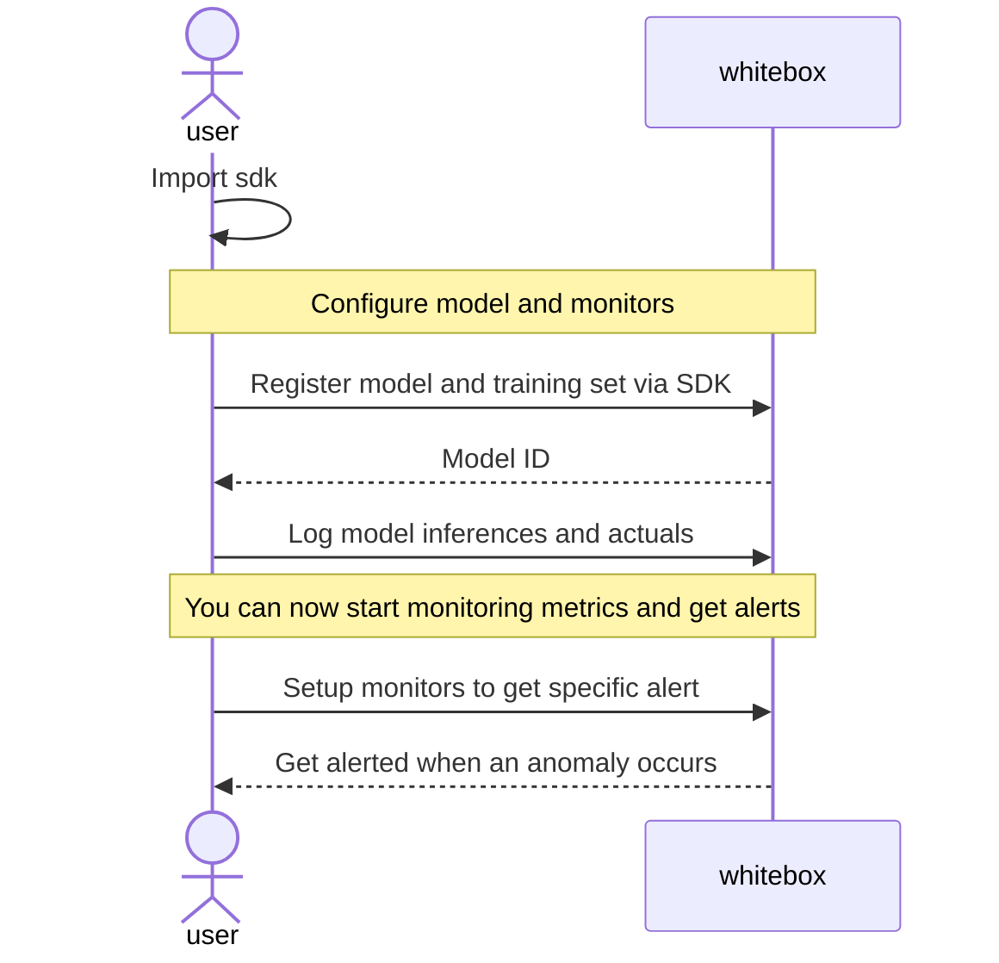

<p align="center"></p>

# Whitebox - Machine learning monitoring platform

## What is Whitebox?

Whitebox is an open source E2E ML monitoring platform with edge capabilities that plays nicely with kubernetes.

## Why use Whitebox?

Deploying a machine learning model in production is not the end of the lifecycle. You need data to iterate and improve.

<p align="center"></p>

# How to use

## Run the server

The project is still in rapid development so to run the server clone the repo and run:

```bash
python -m venv .venv
pip install -r requirements.txt
ENV=dev uvicorn src.main:app --reload
```

In the near future you will be able to `pip install whitebox` and run `whitebox serve` to run whitebox.

## High level diagram of model set up

All you have to do is register a model and send inference data through the SDK.



# Features

You can see all planned features on our [v1.0 milestone](https://github.com/squaredev-io/whitebox/milestone/1).

## Coming soon

- 📖 Docs
- 💻 Whitebox UI
- 📈 Regression models
- 🤖 Edge / privacy features

# Set up locally for development

Install packages:

```bash
python -m venv .venv
pip install -r requirements.txt
pre-commit install
```

Run the server:

```bash
ENV=dev uvicorn src.main:app --reload
```

Tests:

- Run: `ENV=test pytest -s`
- Watch: `ENV=test ptw`
- Run test coverage `ENV=test coverage run -m pytest`
- Look at coverage report: `coverage report` or `coverage html` to generate an html. To view it in your browser open the `htmlcov/index.html` file.

# Contributing

We happily welcome contributions to Whitebox. You can start by opening a new issue!
