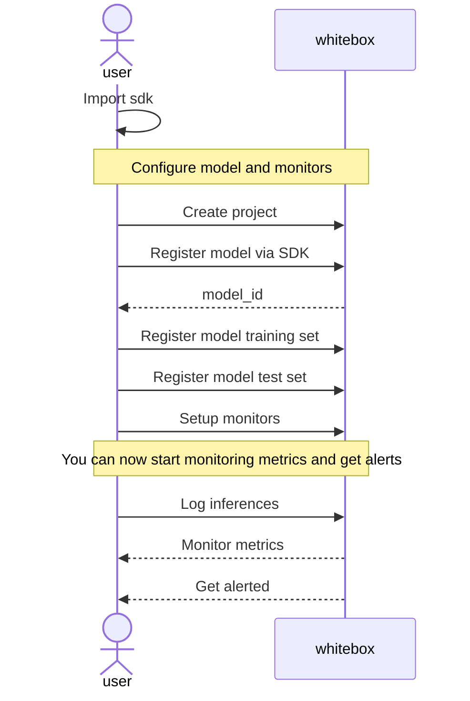

<p align="center"></p>

# Whitebox - Machine learning monitoring platform

## What is Whitebox?

Whitebox is an open source E2E ML monitoring platform with edge capabilities that plays nicely with kubernetes.

https://squaredevio-my.sharepoint.com/:v:/g/personal/kostas_siabanis_squaredev_io/ES9qVWbM_QlHlQWJa9RKNY4B3iFcJ0fPyB2R36O_CcSGEg?e=p1cXsk

## Why use Whitebox?

Deploying a machine learning model in production is not the end of the lifecycle. You need data to iterate and improve.

# How to use

## Run the server

> 👉 Coming soon. You can use development environment described below until everything is ready

## Using the SDK

> 👉 Coming soon

## High level diagram of model set up

All you have to do is register a model and send inference data through the SDK.



# Features

## Planned

- [ ] Minimum viable API
- [ ] Supported model types: Binary classification, Multi-class classification
- [ ] Supported data types: structured
- [ ] Feature importance on inference using SHAP values (XAI)
- [ ] Monitors set up through API
- [ ] Alerts accessible through API via pull
- [ ] Grafana integration

## Coming soon

- Whitebox UI
- Regression models
- Data segments
- Edge / privacy features

## Available metrics

- Data drift per feature compared to training
- Prediction / concept drift per feature compared to training
- Missing values for model input data
- Model performance monitoring (classification):
  - Precision
  - Recall
  - F1
  - Accuracy
  - Confusion matrix

# Set up locally for development

Install packages:

```bash
python -m venv .venv
pip install -r requirements.txt
```

Run the server:

```bash
ENV=dev uvicorn src.main:app --reload
```

Tests:

- Run: `ENV=test pytest -s`
- Watch: `ENV=test ptw`
- Run test coverage `ENV=test coverage run -m pytest`
- Look at coverage report: `coverage report` or `coverage html` to generate an html. To view it in your browser open the `htmlcov/index.html` file.

# Contributing

We happily welcome contributions to Whitebox. Open issues with ideas
