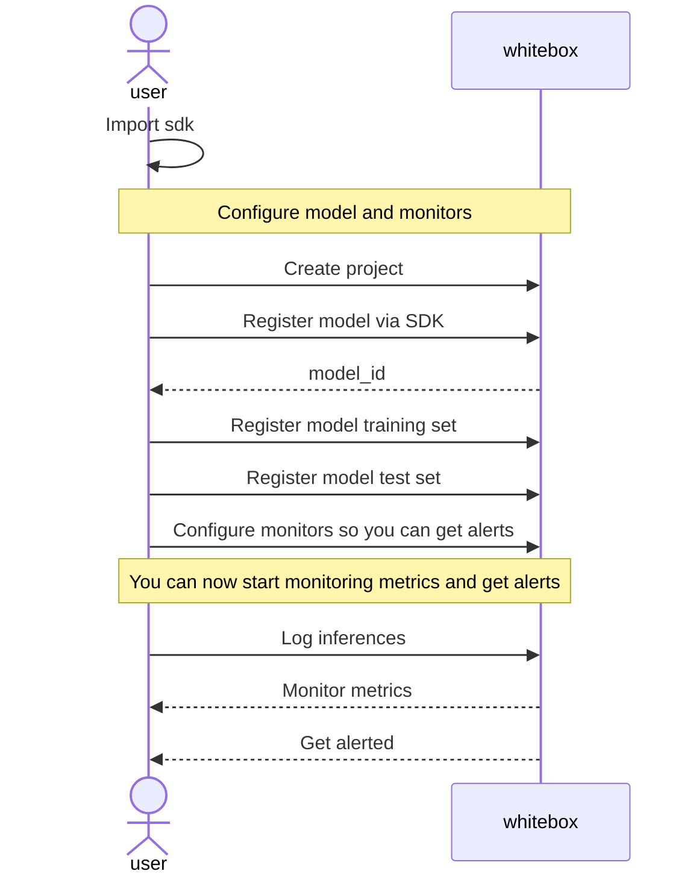

<p align="center"></p>

# Whitebox - Machine learning monitoring platform

## What is Whitebox?

Whitebox is an open source E2E ML monitoring platform with edge capabilities that plays nicely with kubernetes.

## Why use Whitebox?

Deploying a machine learning model in production is not the end of the lifecycle. You need data to iterate and improve.

# How to use

## Run the server

> 👉 Coming soon. You can use development environment described below until everything is ready

## Using the SDK

> 👉 Coming soon

## High level diagram of model set up

All you have to do is register a model and send inference data through the SDK.



# Roadmap

## Development status

Whitebox is still in rapid development.

## Planned features

- API and SDK
- Supported model types: Binary, Multi-class
- Supported data types: tabular
- XAI: Feature importance on inference
- Available monitors through API
  - Data drift per feature compared to training
    - For numeric fields: Jensen–Shannon divergence
    - For categorical fields: Hellinger distance
  - Prediction / concept drift per feature compared to training
  - Missing values for model input data
  - Model performance monitoring:
    - Mean Squared Error
    - Root Mean Squared Error
    - Mean Absolute Error
    - Precision
    - Recall
    - F1
    - Accuracy
    - True Positive Count
    - True Negative Count
    - False Positive Count
    - False Negative Count
- Alerts accessible through API via pull

# Set up locally for development

Install packages:

```bash
python -m venv .venv
pip install -r requirements.txt
```

Run the server:

```bash
ENV=dev uvicorn src.main:app --reload
```

Run tests:

```bash
ENV=test pytest -s
```
